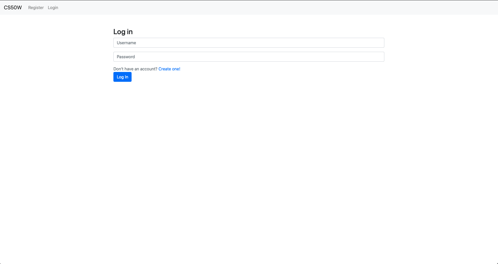
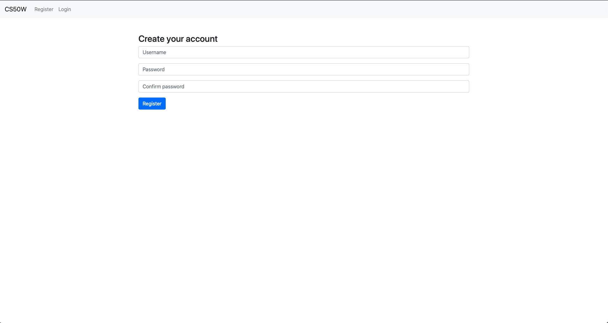
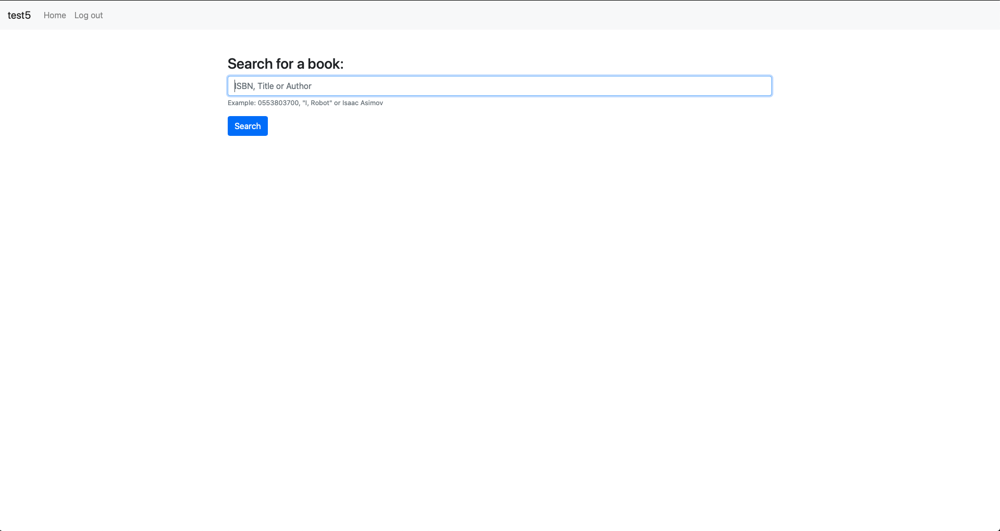
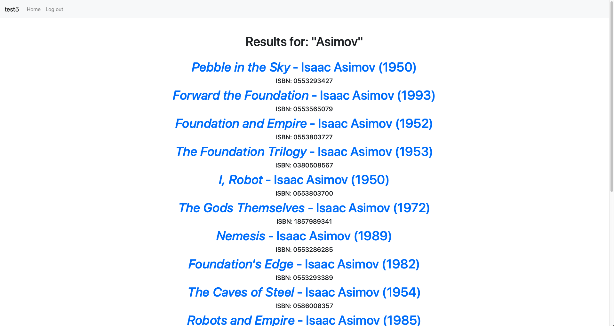
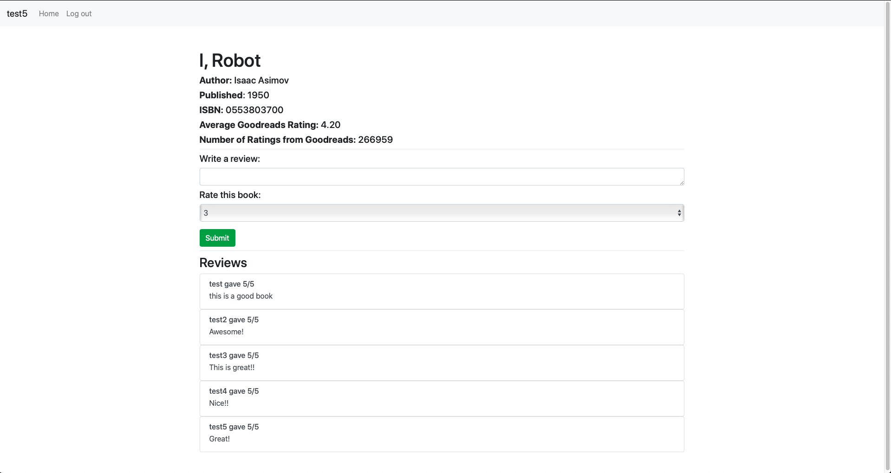
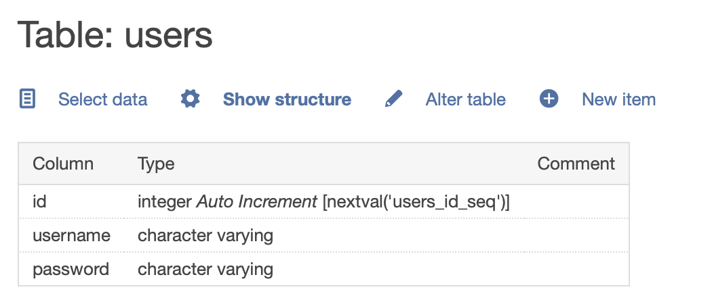
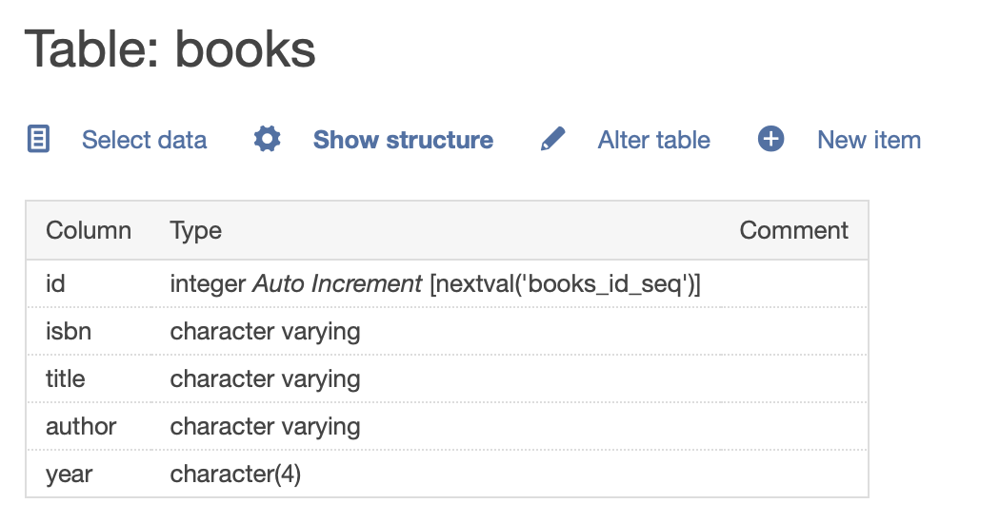
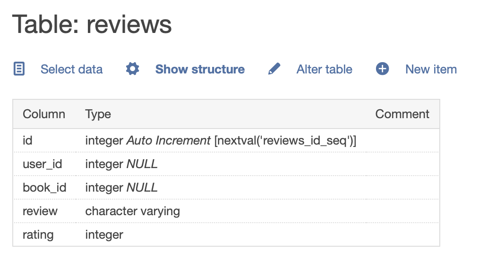

# Project 1

As part of the CS50 Web Programming with Python and JavaScript course,  one of the projects is to create a book review website.

Link: https://www.edx.org/course/cs50s-web-programming-with-python-and-javascript

## Screenshots

## Database schema

